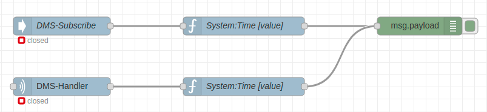

# node-red-contrib-promosnt-connector

> NODE-RED ProMoS NT library by MST-Systemtechnik AG.


## Overview

This node allows Node-RED developers to quickly build a connection to the [ProMoS NT](https://www.promosnt.ch/).

## Installation and Usage

`npm i node-red-contrib-promosnt-connector`

1. You can look for "node-red-contrib-promosnt-connector" in "manage palette", or go to your Node-RED users directory and run the `npm install`-command above 
2. Start Node-RED
3. Drag-in a `Handler-Node` or a `Subscribe-Node` and create a server-configuration
4. When you run the node-red-server on another machine, enable the ip in the `DMS_JSON_IPS.cfg` of your ProMoS NT project
5. Deploy and check the status
6. When the connection is established, then it's ready to use


### Nodes

- DMS-Handler
- DMS-Subscribe
- DMS-Write
- DMS-Value

#### DMS-Handler

Full controll of the JSON-Exchange API.

#### DMS-Subscribe

Subscribe variables to get the actual data.

#### DMS-Write

Write a specific datapoint.

#### DMS-Value

Filter the response-object of a `DMS-Handler-node` or `DMS-Subscribe-node`.

### Example flow


#### Simple Example



```
[{"id":"b456f519.151108","type":"tab","label":"ProMoS NT Example","disabled":false,"info":" * Create a server\n * Select the server-instance in each node where a server is required\n * Deploy it\n * Check the debug-window"},{"id":"e983a29c.3367d","type":"dms-subscribe","z":"b456f519.151108","name":"DMS-Subscribe","server":"f88721d9.a78e","subscribedEvent":"onChange","payload":"[\"System\"]","x":300,"y":160,"wires":[["98833042.af094"]]},{"id":"98833042.af094","type":"dms-value","z":"b456f519.151108","action":"subscribe, event","key":"value","path":"System:Time","x":600,"y":160,"wires":[["8ff321fe.5723e"]]},{"id":"8ff321fe.5723e","type":"debug","z":"b456f519.151108","name":"","active":true,"tosidebar":true,"console":false,"tostatus":false,"complete":"false","x":890,"y":160,"wires":[]},{"id":"58257c3d.dc7d24","type":"dms-handler","z":"b456f519.151108","name":"","server":"f88721d9.a78e","payload":"{\"whois\":\"MyServiceName\",\"user\":\"\",\"subscribe\":[{\"path\":\"System\",\"event\":\"onChange\",\"query\":{\"maxDepth\":0}}]}","x":300,"y":260,"wires":[["1e3fe47b.3689ec"]]},{"id":"1e3fe47b.3689ec","type":"dms-value","z":"b456f519.151108","action":"subscribe, event","key":"value","path":"System:Time","x":600,"y":260,"wires":[["8ff321fe.5723e"]]},{"id":"f88721d9.a78e","type":"dms-server","z":"","host":"localhost","port":"9020","path":"/json_data"}]
```

## Authors

* **MST Systemtechnik AG, Yannick Grund** - *Initial work* - [https://www.mst.ch/](https://www.mst.ch/)

## License

This project is licensed under the ISC License - see the [LICENSE.md](LICENSE.md) file for details
